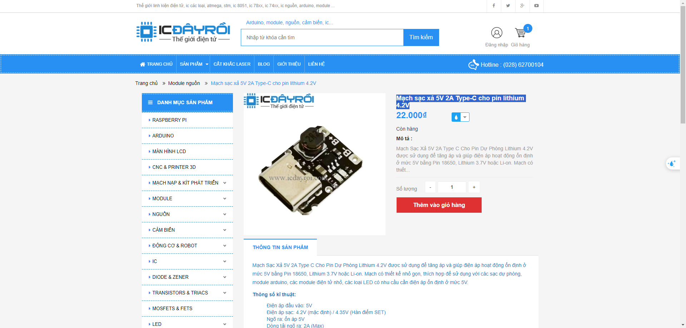

# Control Glove v0.1 Components List

| Tên                                           | Số lượng | Giá     | Hình Ảnh                                                 |
| --------------------------------------------- | -------- | ------- | -------------------------------------------------------- |
| MiniSTM32F4x1 Module                          | 1        | 99.000  |  |
| Mạch sạc xả 5V 2A Type-C cho pin lithium 4.2V | 1        | 22.000  |                           |
| Pin Lipo 2000 mAh                             | 1        | 70.000  |                                      |
| GY-87                                         | 2        | 125.000 |                                           |
| Biến trở 10K                                  | 1        | 28.000  |                                 |
|                                               |          | 469.000 |                                                          |

