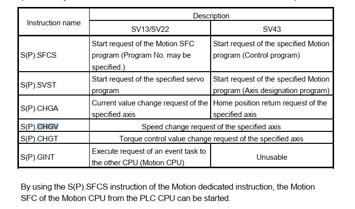

# Runtime (D1400 -> 1409) --> Trigger M3200(Reset error) + M600 (Relay to start runtime)
1. Send data from uart
2. Receive data with x y z and velocity
3. Velocity will be analyze
4. trigger velocity in a special memory
5. 