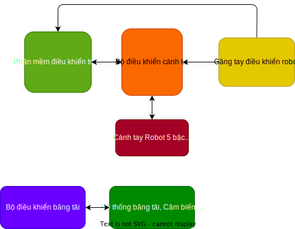
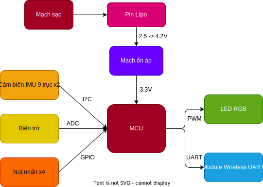

# Tổng quan về đồ án

## Tên đề tài: `Điều khiển tay máy ứng dụng trong xếp sản phẩm`

## Các mục tiêu, giới hạn của đề tài
+ Mục tiêu chung: Nghiên cứu, thiết kế chương trình điều khiển cánh tay robot 5 bậc tự do để sắp xếp, phân loại các thùng sản phẩm từ vị trí này sang vị trí khác áp dụng xử lí ảnh. Chế tạo găng tay điều khiển nhằm giúp người dùng có thể điều khiển robot dễ dàng chỉ bằng cử chỉ của tay. Chế tạo đầu tay gắp đơn giản và tối ưu cho việc gắp các thùng sản phẩm.

## Thiết kế hệ thống
+ Tổng quan hệ thống
  

+ Găng tay điều khiển
  

## Các nhiệm vụ cần làm
+ Thiết kế giải thuật điều khiển robot với quỹ đạo thay đổi liên tục
+ Thiết kế bộ tay gắp bằng giác hút cho robot
+ Lập trình giao diện tạo quỹ đạo cho robot và tự động xác định các vùng bị giới hạn hoạt động
+ Import hệ thống băng tải vào giao diện điều khiển
+ Clean và review lại giao diện điều khiển và tối ưu hóa lại
+ Thiết kế mạch, phần cứng, lấy data, giải thuật lọc nhiễu, xử lí góc, send log về máy tính từ găng tay