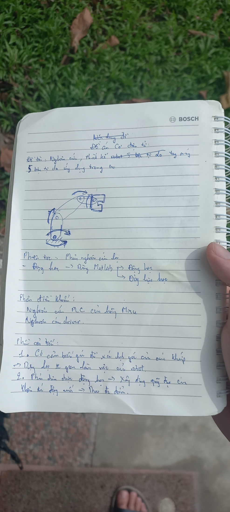
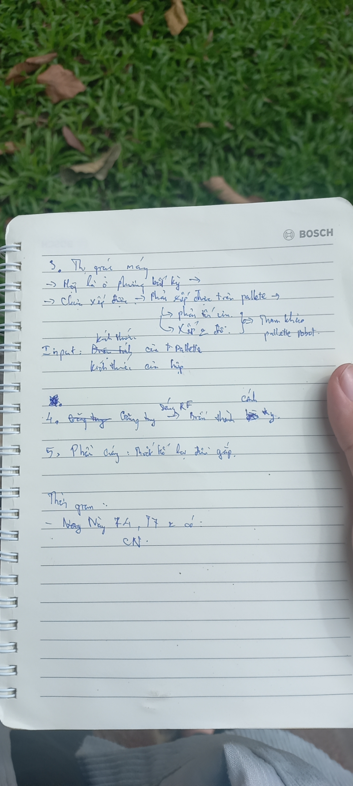
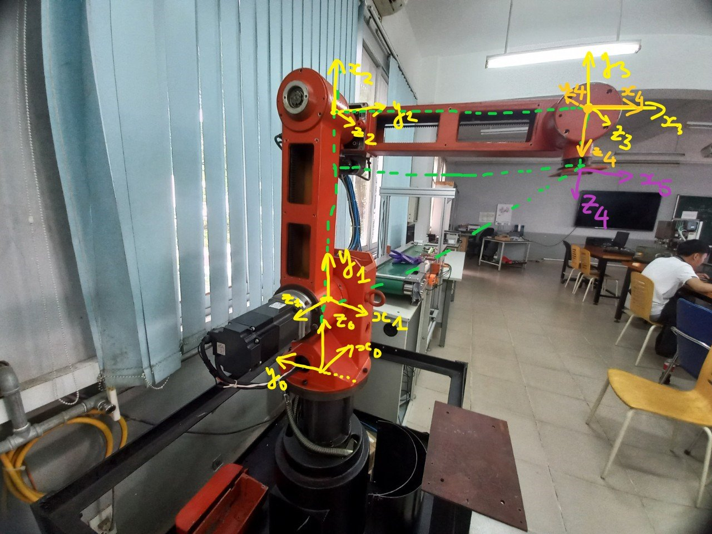
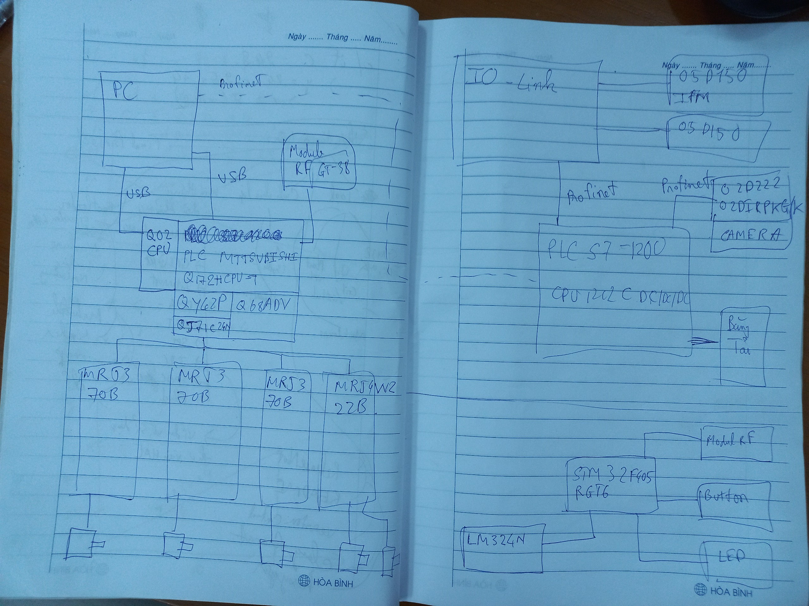
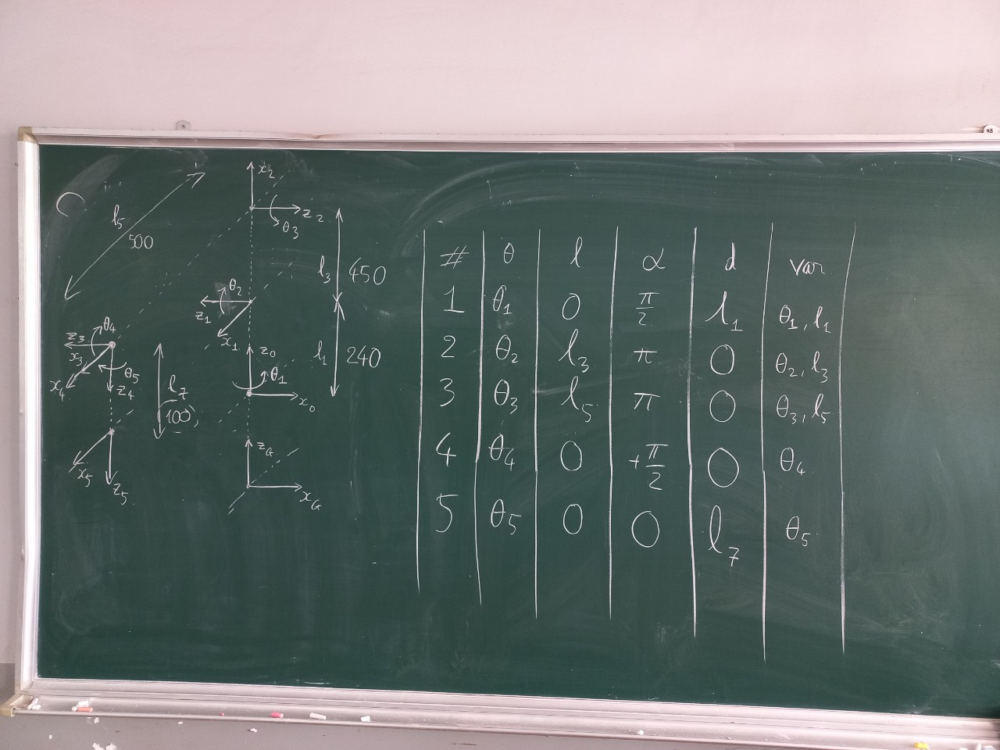
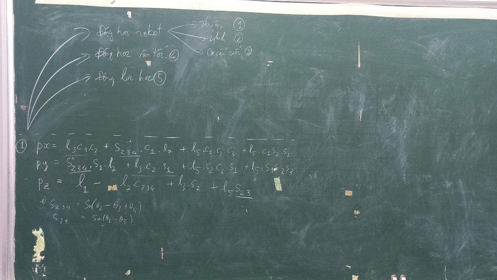
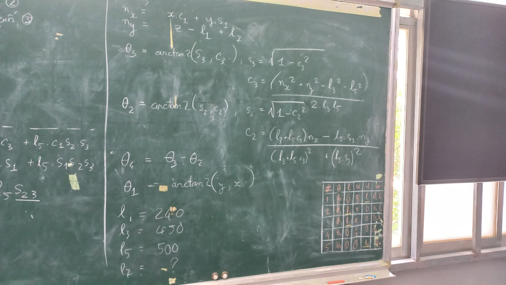

## Tổng hợp thành quả nghiên cứu
### Requirements

  

  

### Hardware Image

  

### Hardware general connection

  

### D-H Tables

  

### Forward Kinematic

  

### Inverse Kinematic

  

### Project Github Link
[5_DOF_ROBOT_ARM](https://github.com/TNH510/5_DOF_Robot_Arm)