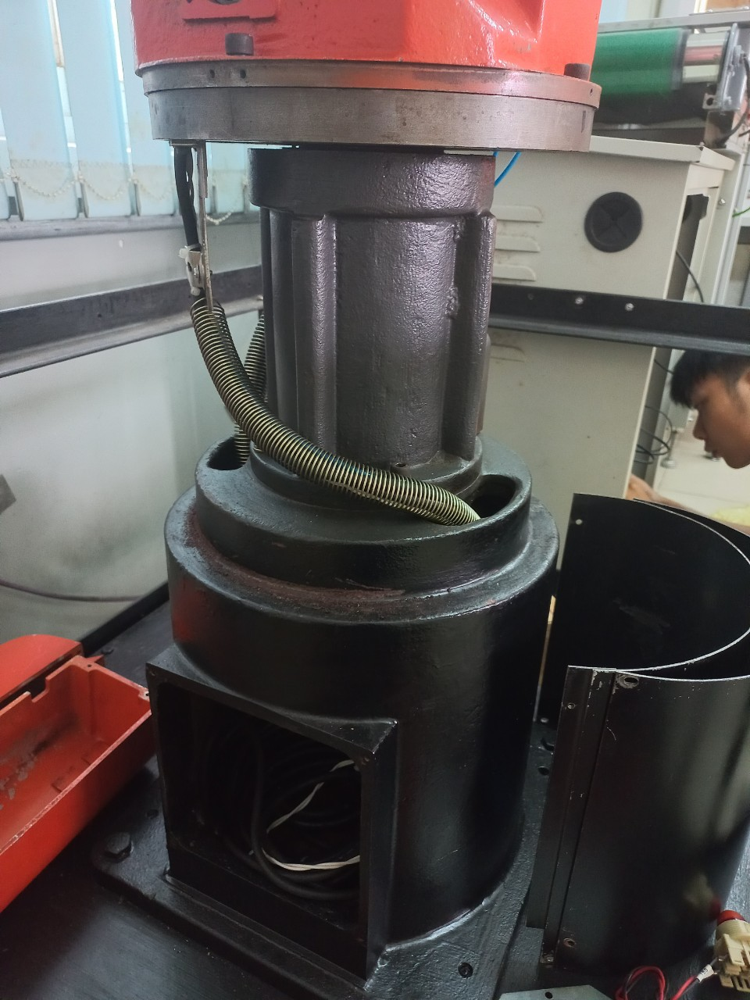
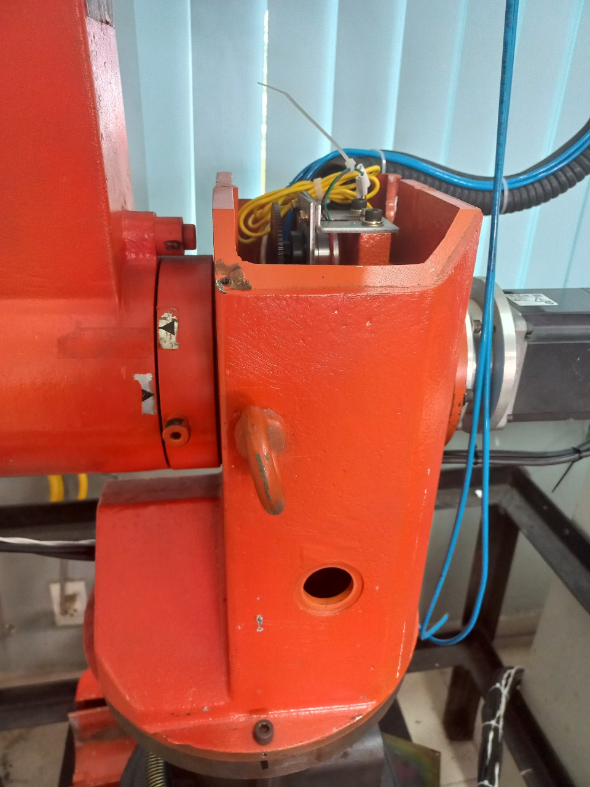
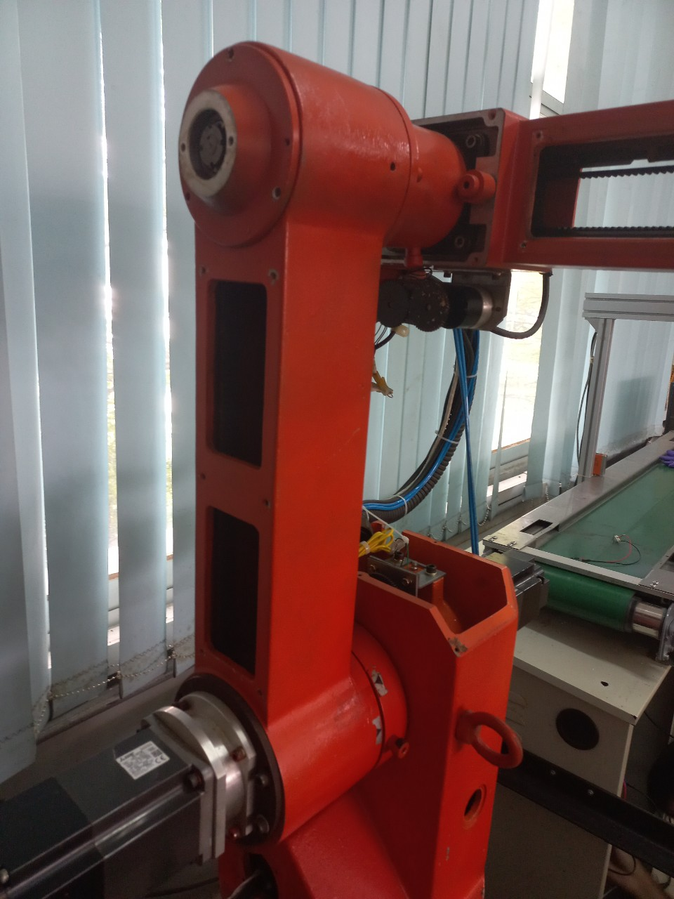
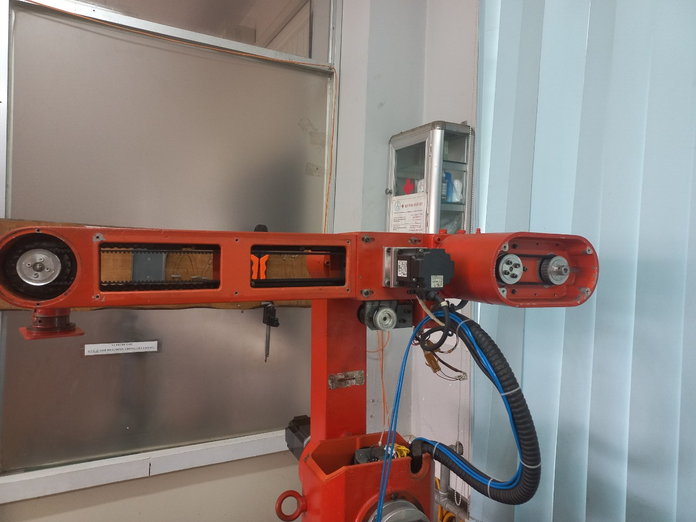
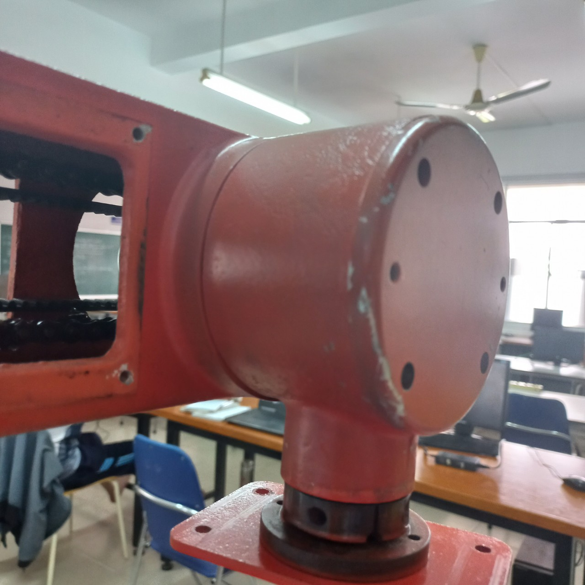
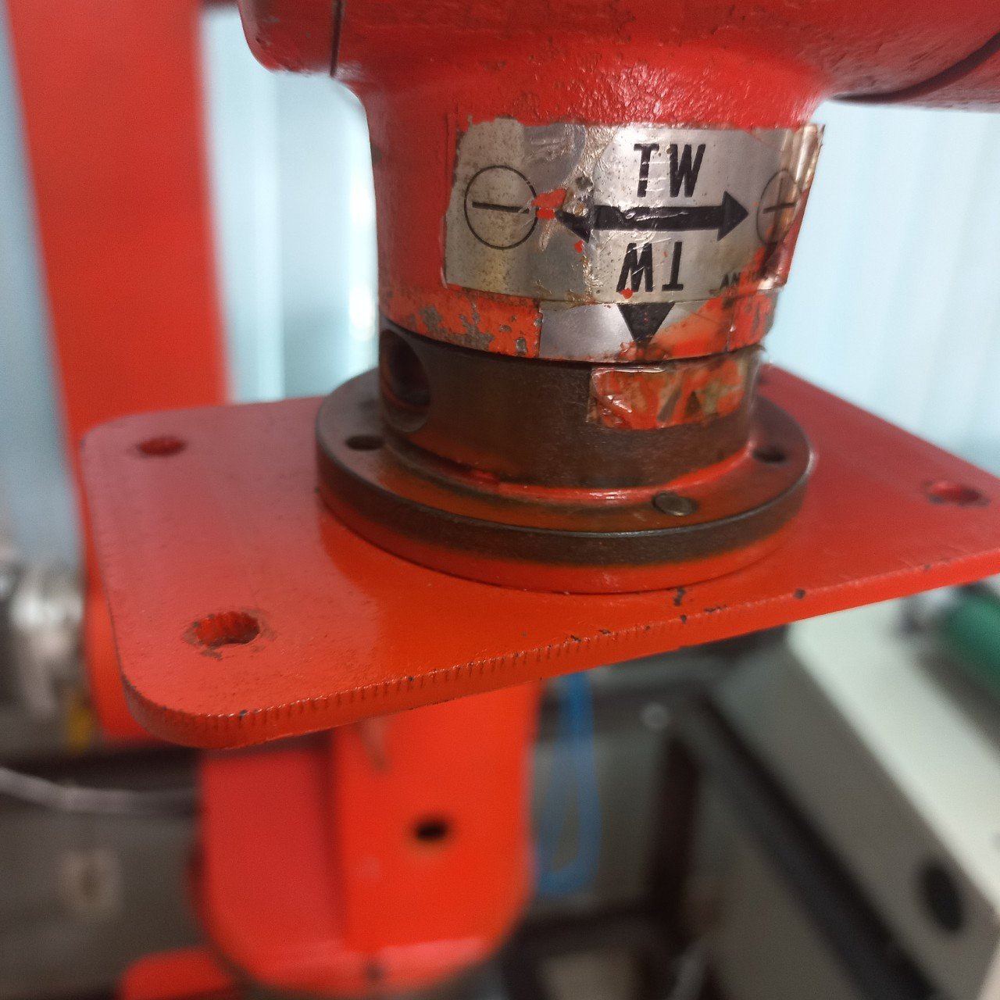
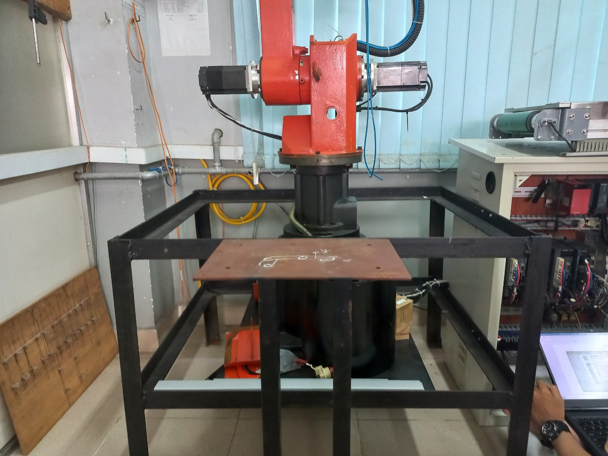
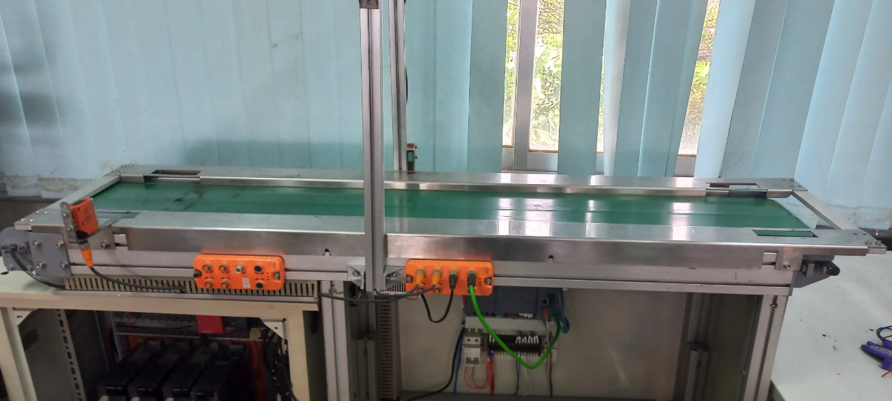

## TỔNG HỢP TÍNH TOÁN THIẾT KẾ CƠ KHÍ CHO CÁNH TAY ROBOT

### Hình ảnh các khâu
+ Khâu cố định

  

+ Khâu 1

  

+ Khâu 2

  

+ Khâu 3

  

+ Khâu 4

  

+ Khâu 5

  

### Hình ảnh băng tải và các thiết bị khác
+ Khung dưới và pallet

  

+ Băng tải

  

### Thông số các bộ truyền giữa các khâu
+ Bộ truyền 1: 
  - Loại bộ truyền: Bánh răng
  - Tỉ số truyền: 1:1?
  - Thông số kích thước: ???

+ Bộ truyền 2: 
  - Loại bộ truyền: Bánh răng
  - Tỉ số truyền: 1:180 ?
  - Thông số kích thước: (số răng, số răng)

+ Bộ truyền 3: Đai (1:1) và bánh răng (?)
  - Loại bộ truyền: 
  - Tỉ số truyền: 1:180 ?
  - Thông số kích thước: (số răng, số răng)

+ Bộ truyền 4: Đai (1:1) + Bánh răng(1:80) + Xích (1:1)
  - Loại bộ truyền: 
  - Tỉ số truyền: 1:80
  - Thông số kích thước: (số răng, số răng)

+ Bộ truyền 5: Đai(1:1) + Bánh răng(1:80)
  - Loại bộ truyền: 
  - Tỉ số truyền: 1:80 ?
  - Thông số kích thước: (số răng, số răng)

### Thiết kế tay gắp
+ Kích thước hộp cần gắp: 
$$
850 * 850 * 750 mm^3
$$

+ Khối lượng hộp cần gắp: ~50g

### Thông số về moment quán tính, vật liệu, kích thước
+ Vật liệu: Thép
+ Công suất 5 động cơ của 5 khớp:
  - Động cơ 1: 750W
  - Động cơ 2: 750W
  - Động cơ 3: 750W
  - Động cơ 4: 200W
  - Động cơ 5: 200W

### Hình vẽ 3D từng khâu
+ Khâu cố định:
+ Khâu 1:
+ Khâu 2:
+ Khâu 3:
+ Khâu 4:
+ Khâu 5:
